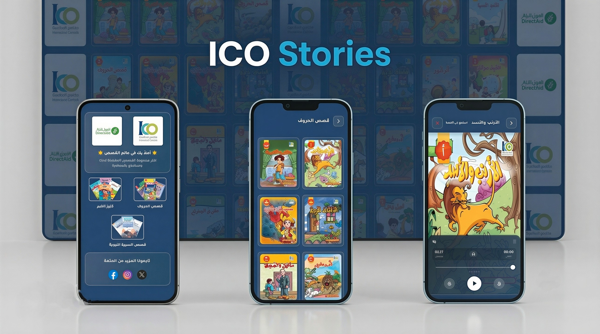
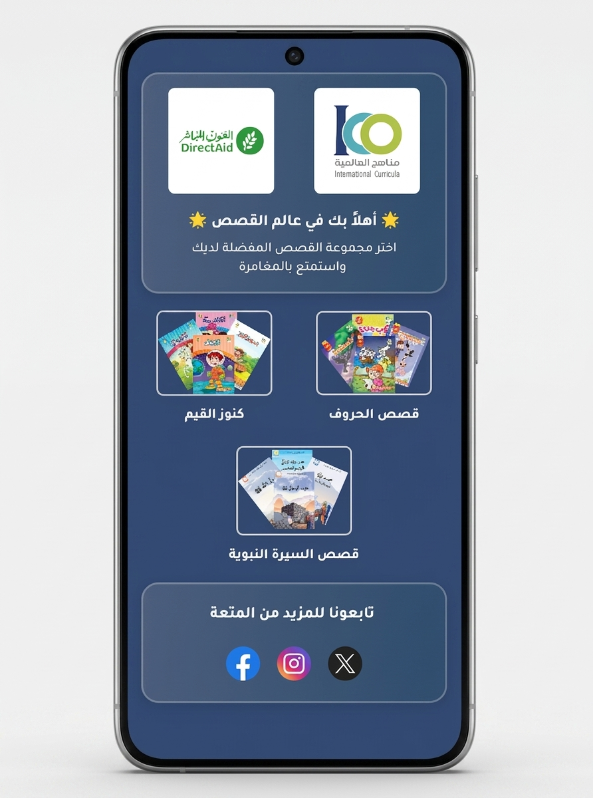
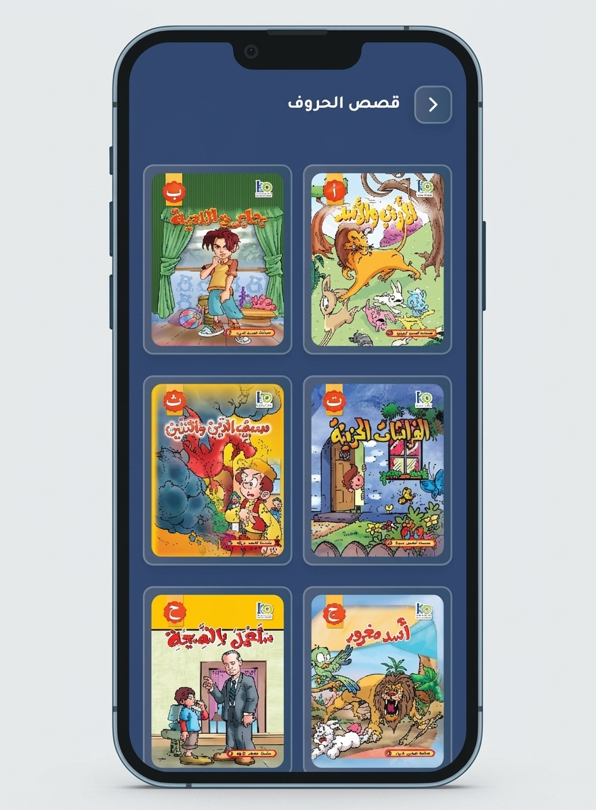
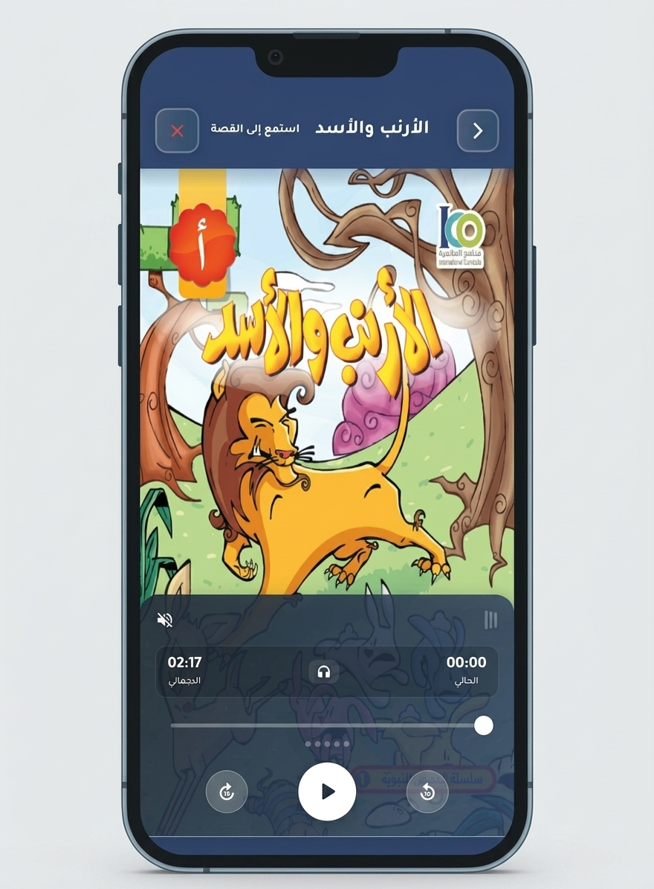

# ico_story_app

<!-- Badges at Top -->

  
  
  

<!-- Typing Logo -->

<!-- Links Section -->

---

## 📸 App Preview

 
 

| | | |
|:---:|:---:|:---:|
|  |  |  |

---

## 🚀 المميزات الرئيسية (Key Features)

<b>📚 مكتبة قصص تعليمية</b>

 

- **مكتبة قصص متنوعة**: مجموعة من القصص التعليمية للأطفال منظمة حسب الفئات.
- **قصص بأكثر من فورمات**: دعم ملفات PDF والصور لتقديم تجربة قراءة متكاملة.
- **تصنيف ذكي**: نظام لتصنيف القصص وتوزيعها بشكل منظم يسهل على الطفل الاختيار.

<b>🎧 تفاعل صوتي</b>

 

- **قصص مسموعة**: إمكانية تشغيل الأصوات المرافقة لكل قصة لتعزيز تجربة الاستماع.
- **التحكم في الصوت**: تحكم كامل في تشغيل وإيقاف الصوت أثناء القراءة.

<b>🎨 واجهة مستخدم مخصصة</b>

 

- **تصميم جذاب للأطفال**: واجهة مستخدم مصممة بعناية لتناسب الأطفال وتجذبهم.
- **دعم اللغة العربية**: واجهة مستخدم عربية بالكامل مصممة بعناية لتناسب الثقافة المحلية.
- **حركات انسيابية**: انتقالات وحركات سلاسة تجعل تجربة الاستخدام ممتعة.

<b>⚙️ تحكم كامل في الإعدادات</b>

 

- **قائمة القصص**: عرض منظم للقصص المتاحة مع إمكانية التصفح بسهولة.
- **شاشة القارئ**: شاشة قراءة مخصصة مع دعم PDF والتنقل بين الصفحات.

---

## 🛠️ Tech Stack

- **Framework**: `Flutter`
- **Architecture**: `Clean Architecture`
- **State Management**: `BLoC / Cubit`
- **Navigation**: `GoRouter`
- **PDF Viewing**: `pdfx / flutter_pdfview`
- **Audio**: `audioplayers / just_audio`
- **Animations**: `animate_do`
- **Utilities**: `logger`, `shared_preferences`, `url_launcher`

---

## 📅 Roadmap

- [x] Initial Release with Story Categories
- [x] Audio Playback Support
- [x] PDF Story Viewer
- [ ] Unit & UI Testing Implementation
- [ ] Comprehensive Project Documentation

---

Made with ❤️ by Korya
 
<b>© 2026 ICO Stories App</b>

